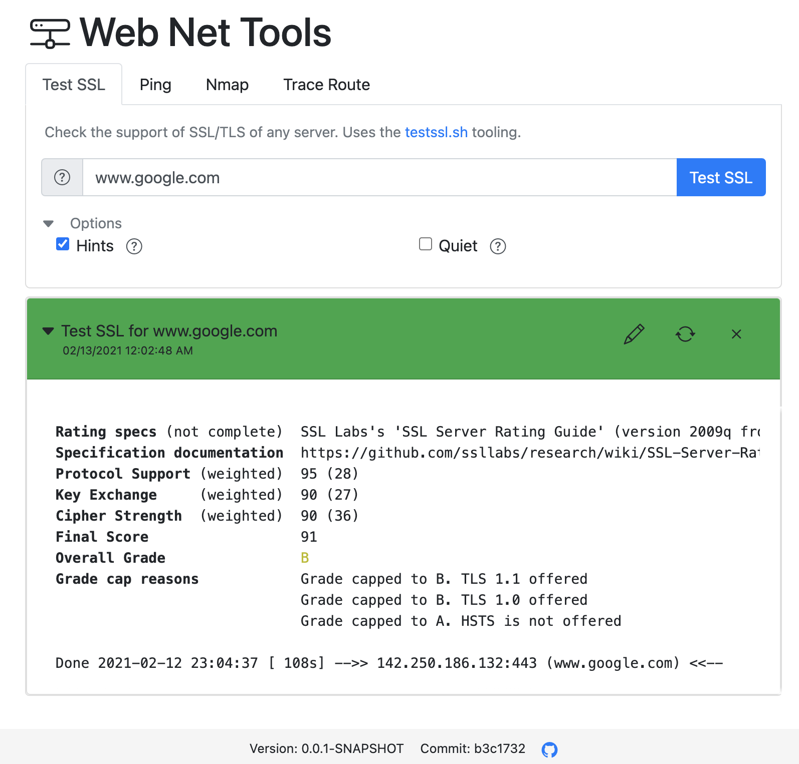
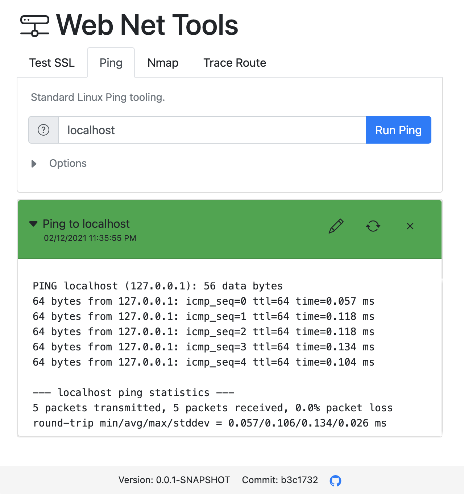

# Web Net Tools
[](https://github.com/johannesschaefer/webnettools/tags)
[](LICENSE)
[](https://hub.docker.com/r/johannesschafer/webnettools)

## NOTICE
This repo is a "pseudo" clone of original repo [johannesschaefer/webnettools](https://github.com/johannesschaefer/webnettools) made by @johannesschaefer.  
I only made some modification to [Dockerfile](Dockerfile).  

Below some parts of the original description I took for my usage.  

Web Net Tools is a web frontend for some useful command line tooling. It provides especially an web frontend for tools like testssl.sh and nmap.
Currently it support the following tools:
* [testssl.sh](https://github.com/drwetter/testssl.sh)
* Ping
* Traceroute
* [Nmap](https://nmap.org)
* Dig
* [MTR](https://www.bitwizard.nl/mtr/)

<p align="center">
  
  
</p>

Web Net Tools is a ready to use Docker image. No additional setup of the mentioned tools is needed.

## Demo

A live demo is available under https://web-net-tools.herokuapp.com.
The demo has a rate limit for each tool to avoid abuse of it.   

## Main usage

This tool was made to make command line tools available in closed networks.
Especially the tool testssl.sh has currently no web frontend and similar tools
in the public internet can't be used in close private networks. Web Net Tools
can help you to make such services available for easy use.

## Usage

Simple run the following Docker command:
```
docker run -p 8080:8080 --name webnettools neomediatech/webnettools
```

## Configuration options

Currently you can configure the following aspects

* Available tools - set the Docker environment variable `AVAILABLE_TOOLS` with an set of the following tools to limit the tools shown in the web frontend: `testssl`, `ping`, `traceroute`, `nmap`. E.g. `AVAILABLE_TOOLS=testssl,nmap`.

* Rate limit - Limits the number of calls of a specific tool to a specific target (e.g. host). The value is set in milliseconds between consecutive calls. E.g. set Docker variable `RATE_LIMIT=60000` to limit the calls to one per minute.

* To set additional certificates for the testssl.sh tool, just map the folder with the certificates to the container folder /certs. This directory can be adjusted by the Docker environment variable `CA_DIR` E.g.
```
docker run -p 8080:8080 -v ./localfolderwithcerts:/certs --name webnettools johannesschafer/webnettools
```


* Intro text - set the Docker environment variable `INTRO_TEXT` to show an additional paragraph in front of the tool selection. This can be used to help the users in your specific environment. HTML tags are supported.


